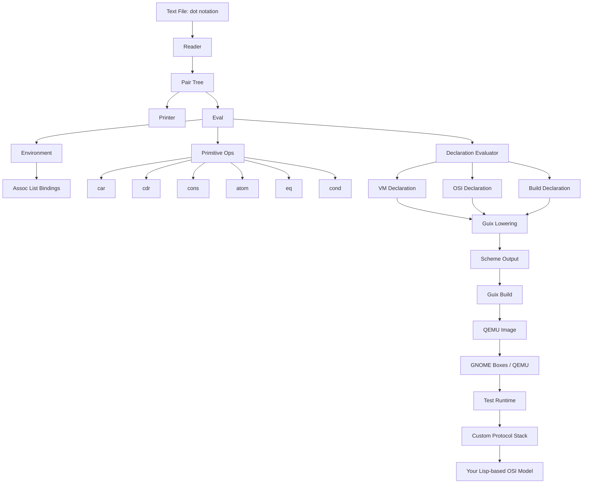

Yes. The clean way to think about this is:

You are not starting with an OS.
You are starting with a **bootstrap ladder**:

**dot notation → Lisp 1.5 core → tiny runtime → declarations → Guix build → QEMU/Boxes VM → experimental OSI stack**

Lisp 1.5 matters here because it gives you a very small, old, stable shape for computation:

* atom
* cons cell
* quote
* eval
* apply
* lambda
* cond
* recursion
* association lists

That is enough to describe code, data, declarations, graphs, packets, sessions, and interpreters without carrying modern language excess.

## The main idea

Use **dot notation** as the canonical source form.

Example:

```lisp
(a . b)
```

Then build upward:

* as data: pair
* as list: `(a . (b . (c . nil)))`
* as record: `((name . vm) . ((arch . x86_64) . nil))`
* as program: a tree of pairs
* as protocol: a tree of declarations
* as machine: a tree of declarations

That means the same substrate can describe:

* your language
* your runtime
* your VM
* your network layers

---

## Mermaid knowledge graph

```mermaid
graph TD

    A[Dot Notation<br/>(a . b)] --> B[Lisp 1.5 Core]
    B --> C[Reader / Parser]
    B --> D[Cons Cells]
    B --> E[Atoms / Symbols]
    B --> F[Eval / Apply]
    B --> G[Assoc Lists]
    B --> H[Lambda / Cond / Quote]

    C --> I[Tiny Lisp Runtime]
    D --> I
    E --> I
    F --> I
    G --> I
    H --> I

    I --> J[Declaration Language]
    J --> K[System Declarations]
    J --> L[Protocol Declarations]
    J --> M[Image / VM Declarations]

    K --> N[Guix Lowering]
    L --> N
    M --> N

    N --> O[Guix Packages]
    N --> P[Guix System/Image]
    N --> Q[Reproducible Build Graph]

    P --> R[QEMU Image]
    R --> S[GNOME Boxes]
    R --> T[Raw QEMU Boot]

    I --> U[Custom Lisp Dialect]
    U --> V[Custom OSI Model]

    V --> W[Layer 1 Physical]
    V --> X[Layer 2 Data Link]
    V --> Y[Layer 3 Network]
    V --> Z[Layer 4 Transport]
    V --> AA[Layer 5 Session]
    V --> AB[Layer 6 Presentation]
    V --> AC[Layer 7 Application]

    W --> AD[Bits / Timing / Device Surface]
    X --> AE[Frames / Checksums / Adjacency]
    Y --> AF[Addresses / Paths / Routing]
    Z --> AG[Streams / Channels / Delivery]
    AA --> AH[State / Continuity / Dialogue]
    AB --> AI[Encoding / Projection / Syntax]
    AC --> AJ[Meaning / Tools / Intent]

    U --> AK[Editor Surface]
    AK --> AL[Atom / Electron]
    AL --> AM[Syntax Highlighting]
    AL --> AN[REPL Panel]
    AL --> AO[Build / Boot Controls]
    AL --> AP[Log / Graph Views]

    T --> AQ[Kernel / Init Experiments]
    S --> AQ
    AQ --> AR[Your Own OS / Protocol Research]
```

---

## The same graph as a bootstrap sequence


---

## How to bootstrap this in the right order

Do not start with the whole OSI stack.

Start in this order:

### Stage 1: Dot reader

Read only:

* atoms
* nil
* dotted pairs
* quoted forms

Example accepted inputs:

```lisp
a
nil
(a . b)
(a . (b . nil))
```

### Stage 2: Lisp 1.5 evaluator

Support only:

* `quote`
* `atom`
* `eq`
* `car`
* `cdr`
* `cons`
* `cond`
* `lambda`
* `label` or a minimal named-function equivalent
* `assoc`

That gets you very close to the Lisp 1.5 spirit.

### Stage 3: Tiny declaration language

Represent VM specs and protocol specs as pair trees.

Example:

```lisp
(system .
  ((name . osi)
  . ((memory . 1024)
  . ((kernel . linux)
  . ((packages . (busybox . nil))
  . nil)))))
```

### Stage 4: Lower to Guix

Translate your pair-tree into Scheme forms Guix can build.

### Stage 5: Build QEMU image

Use Guix to produce a bootable image.

### Stage 6: Run in Boxes

Now you have a safe sandbox.

### Stage 7: Implement your OSI layers as declarations plus interpreters

Each layer becomes a symbolic surface, not just a historical networking standard.

---

## Why Lisp 1.5 is such a good target

Because it is small enough to hold in your head.

You do not need:

* objects
* macros at first
* modules
* large standard library
* type system
* modern compiler tower

You only need the old minimum that makes symbolic self-description possible.

Lisp 1.5 is useful here because it is close to:

* pure symbolic lists
* recursive evaluation
* association-list environments
* hand-buildable interpreter

That makes it easier to:

* write in C
* port into a VM
* reason about bootstrapping
* keep runtime compatibility simple

For your goal, Lisp 1.5 is not nostalgia. It is a **size constraint**.

---

## What “tiny Lisp runtime” usually means

A tiny Lisp runtime is just the smallest executable environment needed to run Lisp forms.

Usually it includes:

* a reader
* a symbol table
* cons cell allocation
* a printer
* an environment representation
* eval/apply
* a few primitives

In C, the core data model is often basically this:

```c
typedef enum {
    CELL_NIL,
    CELL_SYMBOL,
    CELL_PAIR,
    CELL_PRIMITIVE,
    CELL_CLOSURE
} CellType;

typedef struct Cell Cell;

struct Cell {
    CellType type;
    const char *symbol;
    Cell *car;
    Cell *cdr;
    Cell *env;
    Cell *params;
    Cell *body;
    Cell *(*prim)(Cell *args, Cell *env);
};
```

That is already enough to imagine:

* `cons`
* `car`
* `cdr`
* symbol lookup
* closures
* primitive functions

A tiny Lisp runtime is “tiny” because it does not try to be a full language platform. It only tries to preserve the symbolic model.

---

## The runtime layers you actually need

You can model your own system as three runtimes.

### 1. Reader runtime

Turns text into pairs.

Input:

```lisp
(a . (b . nil))
```

Output:

a pair tree.

### 2. Eval runtime

Turns pair trees into values.

Input:
a form plus environment.

Output:
a symbol, pair, or closure.

### 3. Declaration runtime

Turns pair trees into build artifacts.

Input:
a VM declaration.

Output:
Guix config, then image, then VM.

That third runtime is the one many people forget. But for your project it is central.

---

## Your custom OSI model in Lisp terms

You can reinterpret each layer as a Lisp problem.

### Layer 1: Physical

Representation of bits, clocks, symbols, timing.

Lisp form:

```lisp
(physical . ((bit-width . 8) . ((clock . monotonic) . nil)))
```

### Layer 2: Data Link

Frames, boundaries, checksums, neighboring nodes.

```lisp
(link . ((frame . packet) . ((checksum . xor) . nil)))
```

### Layer 3: Network

Addressing and path selection.

```lisp
(network . ((address . node-id) . ((route . graph-walk) . nil)))
```

### Layer 4: Transport

Reliable or structured carriage.

```lisp
(transport . ((channel . stream) . ((retry . nil) . nil)))
```

### Layer 5: Session

Identity over time.

```lisp
(session . ((peer . endpoint) . ((state . continuation) . nil)))
```

### Layer 6: Presentation

Encoding, projection, textual or structural transformation.

```lisp
(presentation . ((encoding . dotted-pairs) . ((render . text) . nil)))
```

### Layer 7: Application

Meaningful operations.

```lisp
(application . ((service . repl) . ((intent . evaluate) . nil)))
```

So your OSI model can literally be a family of symbolic declarations.

---

## Recommended mental split

Keep these separate:

### Canonical

* dot notation
* Lisp 1.5 subset
* declarations

### Realization

* Guix lowering
* package closure
* disk image
* QEMU machine

### Projection

* Atom/Electron editor UI
* logs
* graphs
* boxes GUI
* rendered protocol diagrams

That separation will save you a lot of pain.

---

## Suggested project tree

```text
osi/
├── core/
│   ├── reader.c
│   ├── eval.c
│   ├── runtime.c
│   ├── printer.c
│   └── builtins.c
├── lisp/
│   ├── boot.lisp
│   ├── prelude.lisp
│   └── osi.lisp
├── declarations/
│   ├── vm.dotl
│   ├── system.dotl
│   └── network.dotl
├── guix/
│   ├── lower.scm
│   ├── image.scm
│   └── packages.scm
├── vm/
│   ├── build.sh
│   ├── run-qemu.sh
│   └── boxes/
├── editor/
│   ├── grammar.cson
│   ├── snippets.cson
│   └── package/
└── docs/
    ├── bootstrap.md
    ├── osi-model.md
    └── runtime.md
```

---

## What to build first

Build these in this exact order:

### 1. Reader

Parses dotted pairs.

### 2. Printer

Prints them back out.

### 3. Cons allocator

Can make and traverse trees.

### 4. Env + assoc

Can bind symbols.

### 5. Eval/apply

Minimal Lisp 1.5 core.

### 6. Declaration subset

A few keywords for system description.

### 7. Guix lowering

Emit Scheme.

### 8. VM builder

Produce image.

### 9. QEMU/Boxes runner

Boot the result.

### 10. OSI experiments

Now start building your custom layered protocol stack.

---

## Where Atom/Electron fit

They should stay only at the editor surface.

Good uses:

* syntax highlighting for dot notation
* buttons for “build image”
* REPL console
* graph viewer
* VM launch integration
* logs for network layers

Bad use:
making Electron part of your canonical runtime.

Do not let the editor become the language.

---

## Tiny Lisp runtimes worth studying conceptually

Without browsing, I can still tell you the categories that matter.

### Minimal educational interpreters

These are tiny evaluators showing:

* reader
* env
* eval/apply
* closures

Best for understanding.

### Embedded Lisp runtimes

These are designed to be linked into C programs.
Good for:

* VM control
* config
* scripting

### Scheme-like micros

These are often smaller or cleaner than full Lisp systems, but sometimes move away from Lisp 1.5 simplicity.

For your project, the key thing is not which tiny Lisp you adopt.
It is which one teaches you the smallest correct core.

You likely want to **write your own** after studying one or two tiny interpreters, because your declaration model is unusual.

---

## The holy-grail bootstrap in one sentence

Write a tiny Lisp 1.5-style interpreter in C that reads pure dotted pairs, use it to express VM and protocol declarations, lower those into Guix system/image specs, and boot them under QEMU/GNOME Boxes while developing your own Lisp-native OSI model.

---

## A second Mermaid graph focused on implementation



---

## Very small first milestone

A good first milestone is not “boot my own OS.”

It is this:

1. Write a file:

```lisp
(vm . ((name . osi) . ((memory . 512) . nil)))
```

2. Parse it into a pair tree.
3. Print it back correctly.
4. Lower it into a tiny Guix config.
5. Build one bootable VM image.
6. Run it in Boxes.

That alone proves the ladder works.

---

## About “why Lisp 1.5 feels important”

My guess is that it matters to you because it is close to the last point where:

* code still looks like raw symbolic structure
* the evaluator is still understandable
* the runtime is still small enough to rewrite yourself
* you can believe in complete bootstrap from first principles

That makes it feel like a “holy grail,” because it is the smallest thing that still feels like a whole world.

If you want, next I can turn this into a **concrete bootstrap plan with 4 phases**, and I can also give you a **Mermaid graph just for the OSI layers expressed in dotted-pair Lisp**.
